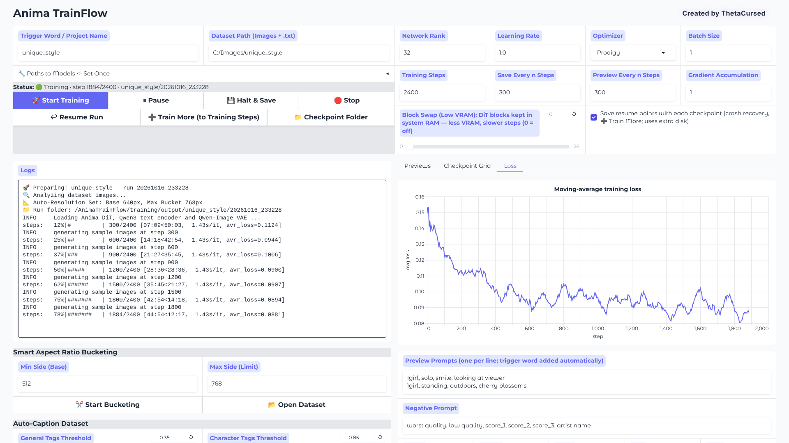

# Anima TrainFlow — Fork

A one-page GUI for training LoRAs on the **Anima 2B** anime model, tuned for NVIDIA GPUs with as little as **6 GB of VRAM**.

This is a fork of [ThetaCursed/Anima-TrainFlow](https://github.com/ThetaCursed/Anima-TrainFlow), which created the app. The fork keeps the same workflow and focuses on making long training runs hard to lose and checkpoints easy to choose. It is not affiliated with or endorsed by the upstream project.

`Raw Images` ➔ `Smart Resize & Crop` ➔ `Auto-Tag` ➔ `Inspect` ➔ `Train` ➔ `Compare Checkpoints` ➔ `Ready LoRA`

> **Current version: 1.10** — see [CHANGELOG.md](CHANGELOG.md) and [Releases](https://github.com/new525/Anima-TrainFlow-fork/releases).
> Fork versions are numbered independently of upstream. Fork 1.1 was built on upstream's v1.1.0 code.

---

## How this fork differs from upstream

| | Upstream (v1.1.0) | This fork (1.10) |
|---|---|---|
| **Refreshing the page during training** | The trainer hangs on a full output pipe, keeping its VRAM, and Stop can no longer reach it | Training carries on; any tab shows the live run |
| **Closing or restarting the app during training** | Training ends | Training carries on; the restarted app reattaches to it |
| **Interrupting a run** | Stop only (progress lost) | ⏸ Pause, 💾 Halt & Save, ↩ Resume Run, crash recovery from resume points |
| **Continuing a finished run** | — | ➕ Train More extends it to a higher step count |
| **Network alpha** | Fixed to the rank | Settable (default: same as rank) |
| **Low VRAM** | No block swapping | Block Swap slider (up to 26 of 28 DiT blocks in system RAM) |
| **Output folders** | One folder per keyword, shared by every run (earlier checkpoints overwritten); keywords with no Latin letters or digits all go to `untitled` | One folder per run: `output/<keyword>/<date_time>/`; any keyword |
| **Picking a checkpoint** | One preview prompt, unlabelled gallery | Several prompts, step × prompt grid, live loss chart, labelled previews |
| **Duplicate images** | Not checked | Identical files and re-saved, resized or mirrored copies found during bucketing and set aside, keeping the largest |
| **Re-running bucketing with new sizes** | Can overwrite your original images with crops | Non-destructive; originals are never touched |
| **Phone photos** | Bucket chosen from unrotated size: cropped the wrong way | Rotated upright first |
| **Captions** | WD tagger only | Tags already embedded by Grabber/exiftool first, written in Anima's caption format; WD tagger for the rest |
| **Dataset formats** | PNG, JPG, WebP, BMP (the tagger skipped BMP) | Also videos and GIFs (their middle frame), AVIF, JPEG XL, HEIC, and anything else Pillow or OpenCV can read |
| **Dataset checks** | Pre-flight (its oversized-image check never fired) | Working pre-flight plus 🔎 Inspect Dataset |
| **Bucketing / tagging during a refresh** | Interrupted with the tab | Run in the background |
| **Trigger word prefix** | `trigger,  tags` (double space); added even if captions already contain it; never actually trained, because the cached captions left it out | `trigger, tags`, and trained; skipped when every caption has it |
| **Caption and image caches** | Reused after a caption or image is edited, or after renaming shifts names onto other pictures | Encoded again whenever the caption text or the image file changed |

The complete list, including smaller fixes, is in [CHANGELOG.md](CHANGELOG.md).


*The fork's interface during a training run, with the Loss tab open (demo run).*

---

## Installation (Windows)

> **Don't use upstream's 3 GB portable download for this fork.** It contains upstream's code, so you would get none of the changes above. This fork already bundles its own Python, so no portable build is needed.

**Requirements**
* Windows 10/11.
* An NVIDIA GPU (6 GB+ VRAM) with a driver recent enough for CUDA 12.8; the installer uses PyTorch's CUDA 12.8 build.
* Free disk space for PyTorch, the model files, and your runs. Resume points include optimizer state and are much larger than a LoRA.

### 1. Get the fork
* **Easiest:** download the zip from [Releases](https://github.com/new525/Anima-TrainFlow-fork/releases) and extract it to a folder of your choice.
* **Or with git:**
  ```bash
  git clone https://github.com/new525/Anima-TrainFlow-fork
  cd Anima-TrainFlow-fork
  ```

Either way you get `python_embeded/`, an embedded Python 3.10 with pip. There's no separate Python to install.

### 2. Install dependencies
Run **`Install_Requirements.bat`**. It installs PyTorch (CUDA 12.8) and the training dependencies into `python_embeded/`.

### 3. Download the models
Put each file in the folder shown; these are the paths the app uses by default. If you already have the files elsewhere, for example in ComfyUI, you can point the app at them instead (step 4).

| What | File | Put it in | Download |
|---|---|---|---|
| Anima DiT (base) | `anima-base-v1.0.safetensors` | `models/anima/dit/` | [circlestone-labs/Anima](https://huggingface.co/circlestone-labs/Anima/blob/main/split_files/diffusion_models/anima-base-v1.0.safetensors) |
| Text encoder (Qwen3 0.6B) | `qwen_3_06b_base.safetensors` | `models/anima/text_encoder/` | [circlestone-labs/Anima](https://huggingface.co/circlestone-labs/Anima/blob/main/split_files/text_encoders/qwen_3_06b_base.safetensors) |
| VAE (Qwen-Image) | `qwen_image_vae.safetensors` | `models/anima/vae/` | [circlestone-labs/Anima](https://huggingface.co/circlestone-labs/Anima/blob/main/split_files/vae/qwen_image_vae.safetensors) |
| WD tagger (auto-captioning) | `model.onnx` + `selected_tags.csv` | `models/wd-eva02-large-tagger-v3/` | [model.onnx](https://huggingface.co/SmilingWolf/wd-eva02-large-tagger-v3/resolve/main/model.onnx) (1.26 GB), [selected_tags.csv](https://huggingface.co/SmilingWolf/wd-eva02-large-tagger-v3/resolve/main/selected_tags.csv) |
| U2Net (smart cropping) | `u2net.onnx` | `models/u2net/` | [u2net.onnx](https://github.com/danielgatis/rembg/releases/download/v0.0.0/u2net.onnx) |

* The Anima model card says LoRAs should be trained on the **base** model, which is why it's listed here.
* Anima is released under the CircleStone Labs Non-Commercial License; read its terms on the model page.
* For the tagger, download just the two files rather than cloning the repo. A clone also pulls two other formats of the same model, 3.78 GB in total.

### 4. Launch
Run **`start_trainer.bat`**; the UI opens in your browser. If your model files aren't in the default folders, set their paths once under **🔧 Paths to Models**.

### Updating
* **git:** run `git pull`.
* **Zip:** extract the new release, then copy the *contents* of its top folder over your existing install. The zip doesn't contain your settings (`training/settings.json`), runs (`training/output/`) or installed packages, so they are kept.
* Re-run `Install_Requirements.bat` when the changelog says dependencies changed.
  * **1.2.1** (GitHub release 1.3) updated Gradio.
  * **1.4** adds `pillow-jxl-plugin` for JPEG XL and `pillow-heif` for HEIC.
  * **1.5** through **1.10** add no dependencies. (1.9 lists `pandas` and `psutil` explicitly, but they were already installed.)

---

## Using it

### Prepare the dataset
Put your images (`.png`, `.jpg`, `.jpeg`, `.webp`, `.bmp`) in one folder and set it as **Dataset Path**. Other formats can go in too:
* **Videos:** `.mp4`, `.m4v`, `.mov`, `.webm`, `.mkv`, `.avi`, `.wmv`, `.flv`, `.mpg`, `.mpeg`
* **GIF, AVIF, JPEG XL (`.jxl`) and HEIC/HEIF** (iPhone photos) images
* **Anything else Pillow or OpenCV can read**, such as TIFF, PSD, TGA, `.jfif`, a saved `.jpg_large`, or `.3gp` and `.ts` videos. This is on by default; untick *Also convert any other format…* to limit conversion to the formats above.

Then:

1. **✂️ Start Bucketing** resizes and crops images to training buckets.
   * First it turns each video or animation into an image of its middle frame, and converts the other formats to PNG. Training can't read these formats directly. Phone videos come out upright.
   * A multi-page TIFF gives its first page, a layered PSD its flattened image, and a multi-image HEIC its main image.
   * Files that nothing can decode are left where they are and listed in the log. This includes audio, documents and caches.
   * Your originals, including the videos, GIFs and AVIFs, are moved to `original_images/` and never modified.
   * Running it again with different sizes regenerates the crops from those originals.
   * **Min Side** and **Max Side** are rounded to multiples of 64 (Min up, Max down), the bucket step training uses.
   * It refuses, changing nothing, files that would end up with the same name: `cat.jpg` + `cat.png`, `cat.mp4` + `cat.gif`, or names that differ only in letter case like `Cat.png` + `cat.jpg`, which Windows treats as one file.
   * A caption already written for a video (`clip.txt` next to `clip.mp4`) pairs with the image made from it (`clip.png`).
   * **Duplicates are checked** across the whole dataset, including images bucketed in earlier runs.
     * **What counts:** identical files, plus re-saved, resized, recompressed, watermarked or mirrored copies — the typical result of downloading one post from two sites, or a sample alongside the full size.
     * **What happens:** the copy with the most pixels is kept; on a tie, the one with a caption. *Set duplicates aside* (on by default) moves the other copies to `duplicates/`, together with their captions, originals and sidecars. Nothing is deleted; move a file back to restore it.
     * **Captions:** if the kept copy has no caption but a copy being set aside does, the kept copy gets a copy of it.
     * **Untick it** to only list the groups.
     * **`duplicates.log`:** every check that finds duplicates appends the full list to this file in the dataset folder, whether or not they were moved.
       * Each group shows the kept file and every copy, with its size and why it matched.
       * Copies are listed with their path, or where they were moved.
       * A report-only result identical to the previous one isn't appended again.
       * It's a `.log` rather than a `.txt` so it isn't mistaken for a caption.
     * **What isn't a duplicate:** colour variants of the same drawing, different sketches with the same pose, and brightness-edited or cropped versions.
2. **Create .txt captions** writes a `.txt` for every image.
   * **Embedded tags come first.** Tags that a downloader such as Grabber saved inside the image are used as they are, and the WD tagger only handles images without any.
     * **Where it looks:** XMP Subject/Keywords, IPTC Keywords, Windows keywords, or an `.xmp` sidecar. It reads the original in `original_images/` too, so it works after bucketing. It also reads tags saved in GIFs and videos.
     * **Format:** tags are rewritten to Anima's caption format — lowercase, spaces instead of underscores, `@` before artists, and the model card's order: meta, 1girl/1boy…, character, series, artist, general.
     * **Parentheses stay plain**, e.g. `hatsune miku (cosplay)`, in embedded and WD-tagger captions alike. Training reads captions literally, while Forge and ComfyUI strip a prompt's `\(` back to `(` before the text encoder sees it. So the backslash belongs in your prompts, not in captions.
     * **Turn it off** with *Use tags embedded in the images first*.
   * **Recommended Grabber setup.** In Grabber's Exiftool metadata settings, set the key to `Subject` and the value to `%all:includenamespace,unsafe,separator=;%`.
     * The namespaces tell the app which tags are artists, characters and series, so it can add the `@` and order them.
     * `Subject` is stored as XMP, which keeps non-English tags. `Keywords` is stored as IPTC in JPG and PNG, which turns them into `????` when the file is saved.
     * Grabber's docs write keys as `XMP.Subject`; exiftool rejects that form, so use `Subject` or `XMP:Subject`.
3. **🔎 Inspect Dataset** checks the result before you spend an hour training:
   * missing, empty or orphaned captions, and captions named in a different letter case than their image
   * escaped parentheses `\(` `\)` in captions
   * duplicate images
   * videos, GIFs or other formats that haven't been converted yet
   * oversized, small, unreadable or rotated images
   * repeated tags, and the trigger word already in some captions
   * captions with more than one line (training reads only the first)
   * the most frequent tags, and tags present in every caption

4. **🔢 Rename to Numbers** (optional) renames the images to `001`, `002`, … in filename order. Short names avoid Windows' path-length limit once cache suffixes are added.
   * Everything tied to an image is renamed together: caption, original and source in `original_images/`, `.xmp` sidecars, and bucketing's records. Bucketing and captioning keep working afterwards.
   * The old → new names are saved to `rename_map_<time>.json`.
   * It changes nothing if another file already uses one of the new names — for example a leftover `002.txt` that would otherwise become an image's caption.
   * Files pair with their image regardless of letter case (`IMG_0001.JPG` and `img_0001.txt`).
   * If a file is locked by another program part-way, everything already renamed is put back.

These tools and training don't work on the same folder at once. 🚀 Start Training waits until a tool working on its dataset has finished, and Bucketing and Rename refuse a dataset that's being trained. Tools on another folder run normally.

The tools run in the background; their progress shows in the log.

### Train
Set a **Trigger Word**, which also names the run's folder, then press **🚀 Start Training**. The status line above the buttons always shows what's running.

The trigger word is put at the front of every caption that doesn't already have it. Captions and images are encoded once and cached next to the dataset (`cache_text_encoder/`, `latent_cache/`). Each run checks those caches against the current caption text and image files, and encodes again whatever changed, so editing, re-captioning or renaming needs no manual cleanup.

| Button | What it does |
|---|---|
| ⏸ **Pause / ▶ Continue** | Freezes training instantly and continues exactly where it stopped. VRAM stays allocated while paused. |
| 💾 **Halt & Save** | Finishes the current step, saves a LoRA and a full resume point, then exits and frees the VRAM. |
| 🛑 **Stop** | Ends training immediately, without saving. |
| ↩ **Resume Run** | Continues the keyword's newest unfinished run (halted or crashed) from its newest resume point, using the settings it was started with. |
| ➕ **Train More** | Extends the keyword's newest *finished* run up to the current **Training Steps** value. The previous final LoRA is kept. |

More options:
* **Network Alpha:** the LoRA's output is scaled by alpha ÷ rank.
  * **0** (the default) means "same as rank", giving a scale of 1.0, which is how the app always trained before this setting existed.
  * **With AdamW:** Adam's steps don't depend on how large the gradients are, so the scale acts as a multiplier on the effective learning rate. Alpha 16 at rank 32 is roughly half the effective learning rate.
  * **With Prodigy:** Prodigy estimates its own step size, so it should largely compensate for a different alpha. Leaving it at 0 is the safe choice.
  * The log shows the alpha and scale each run uses.
* **Block Swap (Low VRAM):** keeps that many of the 28 DiT blocks in system RAM. This lowers VRAM use at the cost of slower steps. Use it if training runs out of memory.
* **Save resume points with each checkpoint** (on by default): saves a resume point with every checkpoint and keeps the newest two. A crash then costs at most one save interval, and ➕ Train More becomes possible. A 💾 Halt & Save resume point is removed once a newer one exists, or when the run finishes.
* You can refresh the page, close it, or even close the console window and restart the app. Training keeps going, and the restarted app reconnects to it.

### Choose the best checkpoint
* **Preview Prompts:** write one prompt per line. Each is rendered at every preview step, with the trigger word added.
* **Checkpoint Grid** tab: one image of every step × prompt, with steps that saved a LoRA marked.
* **Loss** tab: the moving-average loss over the run.

### Where things go
```
training/output/<keyword>/<YYYYmmdd_HHMMSS>/   one folder per run
├── <keyword>.safetensors                      final LoRA
├── <keyword>-step00000300.safetensors         checkpoints
├── <keyword>-step00000300-state/              resume points
├── sample/                                    previews
├── checkpoint_grid.png
├── configs/  logs/  run.json
```

---

## Status

* **Tested:** the fork's changes are covered by the test suite in [`tests/`](tests/README.md). It runs the real app on Python 3.10, the bundled version, end to end through its API, with a stand-in trainer that mimics the real one's files and output. No GPU is needed.
* **Browser-tested:** the interface has been exercised in headless Chromium. That covers switching tabs mid-run, the loss chart updating, previews, and settings surviving a page refresh.
* **Not yet confirmed:**
  * On a real GPU: halt/resume through the bundled trainer (including the 1.9 fix for resuming with gradient accumulation), and block swap's VRAM savings.
  * On Windows: training surviving a closed console window.

See *Known limitations* in [CHANGELOG.md](CHANGELOG.md), and please open an issue if something misbehaves.

## Technical details
* **Core:** a modified `sd-scripts` for the Anima architecture. This fork adds a halt-request hook, fixes resuming with gradient accumulation (the step count, and the epoch it resumes in), removes Halt & Save resume points once they're superseded, puts the caption prefix (trigger word) into cached text-encoder outputs, and re-encodes cached captions and latents when the caption or image changed.
* **UI:** Gradio 6.17.3 (the newest release compatible with sd-scripts' pinned `huggingface-hub==0.34.3`). The trainer runs as a separate process launched with `accelerate launch`, and the UI follows its log file.
* **Defaults:** BF16, latent and text-encoder caching, and the Prodigy optimizer with a constant learning rate; AdamW uses a cosine schedule.
* **Settings** are auto-saved to `training/settings.json`.

## Credits & license
Anima TrainFlow was created by **ThetaCursed** ([upstream repository](https://github.com/ThetaCursed/Anima-TrainFlow)). This fork's changes are released under the same [MIT License](LICENSE). Anima model weights are © CircleStone Labs under their own license. The bundled `sd-scripts` is by kohya-ss.
